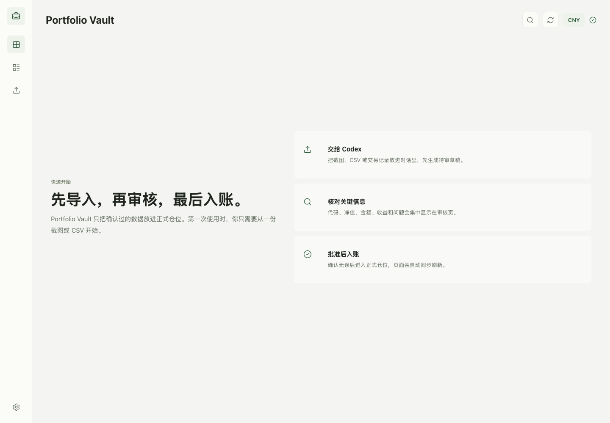

# Portfolio Vault

<p align="center">
  <strong>A local-first Codex plugin for importing, reviewing, and tracking personal investment positions.</strong><br>
  <strong>一个本地优先的 Codex 插件，用于导入、审核和管理个人投资仓位。</strong>
</p>

<p align="center">
  <a href="https://github.com/AIDiscovery007/portfolio-vault"></a>
  
  
  
</p>

<p align="center">
  
</p>

Portfolio Vault turns Codex into a lightweight investment operations console. Drop a brokerage screenshot or CSV into the conversation, let Codex prepare an import draft, review it in a local web UI, then approve it into an append-only local ledger.

Portfolio Vault 可以把 Codex 变成一个轻量的投资仓位工作台。你可以把券商截图或 CSV 放进对话，让 Codex 生成待审导入草稿，在本地 Web UI 里审核，然后确认入账到追加式本地账本。

The project is built around one idea: personal portfolio records should be easy to import, easy to audit, and stored locally by default.

这个项目的核心原则很简单：个人投资记录应该容易导入、容易审核，并默认保存在本地。

## Codex Setup / Codex 安装

Open Codex and paste one of these messages.

打开 Codex，复制下面任意一段话发送给 Codex。

**English**

```text
Please install and enable this Codex plugin: https://github.com/AIDiscovery007/portfolio-vault

Please handle the full setup: download the project to a suitable local folder, install dependencies, register and enable it as a local Codex plugin, initialize the Portfolio Vault data directory, then start the local dashboard and open the page.

If I need to confirm an install path, approve a Codex config change, grant permission, or start a new Codex chat to reload plugins, tell me exactly what to click. When finished, tell me three things: whether the plugin is enabled, where the vault data directory is, and what the dashboard URL is.
```

**中文**

```text
请帮我安装并启用这个 Codex 插件：https://github.com/AIDiscovery007/portfolio-vault

请你全程代办：把项目下载到合适的本地目录，安装依赖，注册并启用为本地 Codex 插件，初始化 Portfolio Vault 数据目录，然后启动本地 dashboard 并打开页面。

如果需要我确认安装路径、修改 Codex 配置、授权，或重开 Codex 线程，请直接告诉我该点哪里。完成后请告诉我三件事：插件是否启用、vault 数据目录在哪里、dashboard 地址是什么。
```

If Codex asks you to reload plugins or start a new chat, do that once. Then say:

如果 Codex 提示你刷新插件或开启新对话，照做一次。然后说：

```text
Open Portfolio Vault.
```

Useful next requests / 后续常用指令：

| Goal | English | 中文 |
| --- | --- | --- |
| Open dashboard | `Open Portfolio Vault.` | `打开 Portfolio Vault。` |
| First-time setup | `Initialize Portfolio Vault.` | `初始化 Portfolio Vault。` |
| Import holdings | `Import this brokerage screenshot into Portfolio Vault as a draft.` | `把这张券商截图导入 Portfolio Vault，先生成待审草稿。` |
| Review portfolio | `Summarize my Portfolio Vault positions.` | `总结一下我的 Portfolio Vault 仓位。` |
| Clean reset | `Reset Portfolio Vault to first-use state.` | `把 Portfolio Vault 重置到首次使用状态。` |

## Highlights / 亮点

| Area | What it does | 中文说明 |
| --- | --- | --- |
| Local dashboard | Runs a localhost UI for reviewing positions, imports, accounts, and portfolio state. | 提供本地页面，用来查看仓位、导入草稿、账户和组合状态。 |
| Draft-first import | Screenshots and CSVs become reviewable drafts before they touch the formal ledger. | 截图和 CSV 会先变成待审草稿，不会直接写入正式账本。 |
| One-click approval | Approved drafts are written into the ledger from the web UI with a lightweight confirmation step. | 用户可以在 Web UI 上确认后入账，并带有轻量二次确认。 |
| Instrument registry | Import approval registers missing instruments from draft metadata to avoid unmapped holdings. | 入账时会基于草稿元数据补全标的注册表，避免出现未映射标的。 |
| Chinese fund lookup | Matches Chinese mutual fund names to fund codes and NAV data through a fixed lookup procedure. | 支持基于固定流程匹配中国基金名称、基金代码和净值数据。 |
| Admin procedures | Built-in init/reset scripts and skills make first-use setup and clean-state testing repeatable. | 内置初始化和重置脚本及 skill，方便首次使用和干净状态测试。 |

## How It Works / 工作流

```text
Broker screenshot / CSV
        |
        v
Codex import skill
        |
        v
Import draft in local vault
        |
        v
Web UI review and approval
        |
        v
Append-only ledger + derived positions
```

```text
券商截图 / CSV
        |
        v
Codex 导入 skill
        |
        v
本地 vault 中的待审草稿
        |
        v
Web UI 审核并确认
        |
        v
追加式账本 + 派生仓位
```

Portfolio Vault stores data in:

Portfolio Vault 默认把数据存放在：

```text
~/Documents/PortfolioVault
```

The plugin source code and the user's investment vault are separate. Resetting the vault never deletes the plugin source tree.

插件源码和用户的投资数据目录是分离的。重置 vault 不会删除插件源码。

## Manual Setup / 手动安装

```bash
git clone https://github.com/AIDiscovery007/portfolio-vault.git
cd portfolio-vault
npm install
npm run vault:init
npm run dev
```

Open / 打开：

```text
http://127.0.0.1:43218/
```

For Codex local plugin usage, this repository contains the full plugin bundle:

这个仓库已经包含 Codex 本地插件所需的完整结构：

```text
.codex-plugin/plugin.json
.mcp.json
skills/
mcp/
```

Enable it as a local Codex plugin, then use the natural-language workflows below.

把它启用为 Codex 本地插件后，就可以继续用自然语言驱动。

## Natural Language Workflows / 自然语言工作流

Once enabled in Codex, you can keep driving the plugin with short requests.

启用后，可以直接用短句继续操作。

| Goal | English request | 中文指令 |
| --- | --- | --- |
| Open dashboard | `Open Portfolio Vault.` | `打开 Portfolio Vault。` |
| First-time setup | `Initialize Portfolio Vault.` | `初始化 Portfolio Vault。` |
| Clean reset | `Reset Portfolio Vault to first-use state.` | `把 Portfolio Vault 重置到首次使用状态。` |
| Import holdings | `Import this brokerage screenshot into Portfolio Vault as a draft.` | `把这张券商截图导入 Portfolio Vault，先生成待审草稿。` |
| Review portfolio | `Summarize my Portfolio Vault positions.` | `总结一下我的 Portfolio Vault 仓位。` |
| Match funds | `Find the accurate fund codes and NAVs for these Chinese fund names.` | `帮我匹配这些中国基金名称的准确基金代码和净值。` |

## Scripts / 脚本

| Command | Purpose | 中文说明 |
| --- | --- | --- |
| `npm run dev` | Start the local web dashboard. | 启动本地 Web dashboard。 |
| `npm run build` | Build the production web UI. | 构建生产版本 Web UI。 |
| `npm run check` | Run TypeScript checks. | 运行 TypeScript 检查。 |
| `npm run vault:init` | Create missing vault files and folders without deleting existing data. | 创建缺失的 vault 文件和目录，不删除现有数据。 |
| `npm run vault:reset` | Reset accounts, instruments, drafts, events, imports, and derived positions. Creates a backup by default. | 重置账户、标的、草稿、事件、导入文件和派生仓位；默认创建备份。 |

Custom vault directory / 自定义 vault 目录：

```bash
npm run vault:init -- --vault-dir /path/to/PortfolioVault
npm run vault:reset -- --vault-dir /path/to/PortfolioVault
```

Reset without backup only when you explicitly want it.

仅在明确需要时跳过备份：

```bash
npm run vault:reset -- --no-backup
```

## Data Model / 数据模型

Portfolio Vault keeps a small local file structure:

Portfolio Vault 使用一个简单的本地文件结构：

```text
PortfolioVault/
  config.json
  events.jsonl
  import-drafts/
  imports/
  derived/
    positions.json
  backups/
```

Key principles / 关键原则：

- Formal records are append-only ledger events.
- Imports start as drafts and require review.
- Derived positions can be rebuilt from ledger state.
- Instrument metadata is registered during import approval when draft rows contain enough evidence.
- Base currency is inferred from account/import data and displayed in the UI.
- 正式记录采用追加式账本事件。
- 导入内容先进入草稿，审核后才入账。
- 派生仓位可以从账本状态重新生成。
- 草稿行有足够元数据时，入账流程会自动注册标的元数据。
- 基准币种会从账户或导入数据中推断，并在 UI 中显示。

## Built-In Skills / 内置 Skills

| Skill | Use it for | 中文说明 |
| --- | --- | --- |
| `portfolio-vault-open` | Open the local service and dashboard. | 打开本地服务和 dashboard。 |
| `portfolio-vault-admin` | Initialize or reset the vault data directory. | 初始化或重置 vault 数据目录。 |
| `portfolio-vault-import` | Turn screenshots or CSVs into reviewable import drafts. | 把截图或 CSV 转成可审核导入草稿。 |
| `portfolio-vault-fund-lookup` | Match Chinese mutual fund names to official codes and NAV data. | 匹配中国基金名称、官方代码和净值数据。 |
| `portfolio-vault-query` | Read and summarize accounts, drafts, instruments, positions, and P&L. | 读取并总结账户、草稿、标的、仓位和收益。 |

## Safety Notes / 安全说明

Portfolio Vault is a recordkeeping and review tool. It does not execute trades and does not provide buy/sell instructions.

Portfolio Vault 是记录和审核工具，不会执行交易，也不提供买卖指令。

Financial data stays in the local vault directory unless you explicitly share files or push them elsewhere. Do not commit `~/Documents/PortfolioVault` into this repository.

除非你主动共享或上传文件，金融数据会保存在本地 vault 目录中。不要把 `~/Documents/PortfolioVault` 提交到这个仓库。

## Development / 开发

```bash
npm run check
npm run build
```

The UI is built with React, Vite, and Lucide icons. The local service exposes API routes from `vite.config.ts`; the MCP server lives under `mcp/`.

UI 基于 React、Vite 和 Lucide icons 构建。本地服务的 API 路由在 `vite.config.ts` 中，MCP server 位于 `mcp/`。

## License / 许可证

MIT License. See [LICENSE](./LICENSE).

MIT 许可证。详见 [LICENSE](./LICENSE)。
