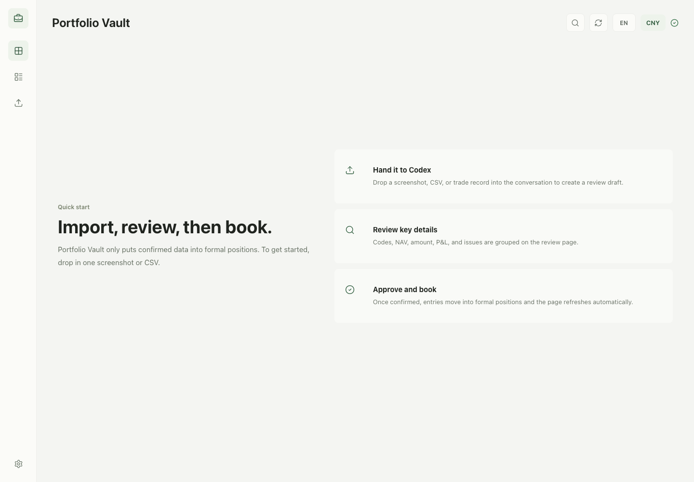

<h1 align="center">
  
  Portfolio Vault
</h1>

<p align="center">
  <strong>A local-first Codex plugin for importing, reviewing, and tracking personal investment positions.</strong>
</p>

<p align="center">
  <a href="./README.zh-CN.md">中文文档</a>
</p>

<p align="center">
  <a href="https://github.com/AIDiscovery007/portfolio-vault"></a>
  
  
  
</p>

<p align="center">
  
</p>

Portfolio Vault turns Codex into a lightweight investment operations console. Drop a brokerage screenshot or CSV into the conversation, let Codex prepare an import draft, review it in a local web UI, then approve it into an append-only local ledger.

The project is built around one idea: personal portfolio records should be easy to import, easy to audit, and stored locally by default.

## Codex Setup

Open Codex and paste this message:

```text
Please install and enable this Codex plugin: https://github.com/AIDiscovery007/portfolio-vault

Please handle the full setup: download the project to a suitable local folder, install dependencies, register and enable it as a local Codex plugin, initialize the Portfolio Vault data directory, then start the local dashboard and open the page.

If I need to confirm an install path, approve a Codex config change, grant permission, or start a new Codex chat to reload plugins, tell me exactly what to click. When finished, tell me three things: whether the plugin is enabled, where the vault data directory is, and what the dashboard URL is.
```

If Codex asks you to reload plugins or start a new chat, do that once. Then say:

```text
Open Portfolio Vault.
```

Useful next requests:

| Goal | Say this in Codex |
| --- | --- |
| Open dashboard | `Open Portfolio Vault.` |
| First-time setup | `Initialize Portfolio Vault.` |
| Import holdings | `Import this brokerage screenshot into Portfolio Vault as a draft.` |
| Review portfolio | `Summarize my Portfolio Vault positions.` |
| Clean reset | `Reset Portfolio Vault to first-use state.` |

## Highlights

| Area | What it does |
| --- | --- |
| Local dashboard | Runs a localhost UI for reviewing positions, imports, accounts, and portfolio state. |
| Draft-first import | Screenshots and CSVs become reviewable drafts before they touch the formal ledger. |
| One-click approval | Approved drafts are written into the ledger from the web UI with a lightweight confirmation step. |
| Instrument registry | Import approval registers missing instruments from draft metadata to avoid unmapped holdings. |
| Chinese fund lookup | Matches Chinese mutual fund names to fund codes and NAV data through a fixed lookup procedure. |
| Admin procedures | Built-in init/reset scripts and skills make first-use setup and clean-state testing repeatable. |

## How It Works

```text
Broker screenshot / CSV
        |
        v
Codex import skill
        |
        v
Import draft in local vault
        |
        v
Web UI review and approval
        |
        v
Append-only ledger + derived positions
```

Portfolio Vault stores data in:

```text
~/Documents/PortfolioVault
```

The plugin source code and the user's investment vault are separate. Resetting the vault never deletes the plugin source tree.

## Manual Setup

```bash
git clone https://github.com/AIDiscovery007/portfolio-vault.git
cd portfolio-vault
npm install
npm run vault:init
npm run dev
```

Open:

```text
http://127.0.0.1:43218/
```

For Codex local plugin usage, this repository contains the full plugin bundle:

```text
.codex-plugin/plugin.json
.mcp.json
skills/
mcp/
```

Enable it as a local Codex plugin, then use the natural-language workflows below.

## Natural Language Workflows

Once enabled in Codex, you can keep driving the plugin with short requests:

| Goal | Example request |
| --- | --- |
| Open dashboard | `Open Portfolio Vault.` |
| First-time setup | `Initialize Portfolio Vault.` |
| Clean reset | `Reset Portfolio Vault to first-use state.` |
| Import holdings | `Import this brokerage screenshot into Portfolio Vault as a draft.` |
| Review portfolio | `Summarize my Portfolio Vault positions.` |
| Match funds | `Find the accurate fund codes and NAVs for these Chinese fund names.` |

## Scripts

| Command | Purpose |
| --- | --- |
| `npm run dev` | Start the local web dashboard. |
| `npm run build` | Build the production web UI. |
| `npm run check` | Run TypeScript checks. |
| `npm run vault:init` | Create missing vault files and folders without deleting existing data. |
| `npm run vault:reset` | Reset accounts, instruments, drafts, events, imports, and derived positions. Creates a backup by default. |

Custom vault directory:

```bash
npm run vault:init -- --vault-dir /path/to/PortfolioVault
npm run vault:reset -- --vault-dir /path/to/PortfolioVault
```

Reset without backup only when you explicitly want it:

```bash
npm run vault:reset -- --no-backup
```

## Data Model

Portfolio Vault keeps a small local file structure:

```text
PortfolioVault/
  config.json
  events.jsonl
  import-drafts/
  imports/
  derived/
    positions.json
  backups/
```

Key principles:

- Formal records are append-only ledger events.
- Imports start as drafts and require review.
- Derived positions can be rebuilt from ledger state.
- Instrument metadata is registered during import approval when draft rows contain enough evidence.
- Base currency is inferred from account/import data and displayed in the UI.

## Built-In Skills

| Skill | Use it for |
| --- | --- |
| `portfolio-vault-open` | Open the local service and dashboard. |
| `portfolio-vault-admin` | Initialize or reset the vault data directory. |
| `portfolio-vault-import` | Turn screenshots or CSVs into reviewable import drafts. |
| `portfolio-vault-position-math` | Apply amount-based holding formulas and batch import row shape. |
| `portfolio-vault-fund-lookup` | Match Chinese mutual fund names to official codes and NAV data. |
| `portfolio-vault-query` | Read and summarize accounts, drafts, instruments, positions, and P&L. |

## Safety Notes

Portfolio Vault is a recordkeeping and review tool. It does not execute trades and does not provide buy/sell instructions.

Financial data stays in the local vault directory unless you explicitly share files or push them elsewhere. Do not commit `~/Documents/PortfolioVault` into this repository.

## Development

```bash
npm run check
npm run build
```

The UI is built with React, Vite, and Lucide icons. The local service exposes API routes from `vite.config.ts`; the MCP server lives under `mcp/`.

## License

MIT License. See [LICENSE](./LICENSE).
