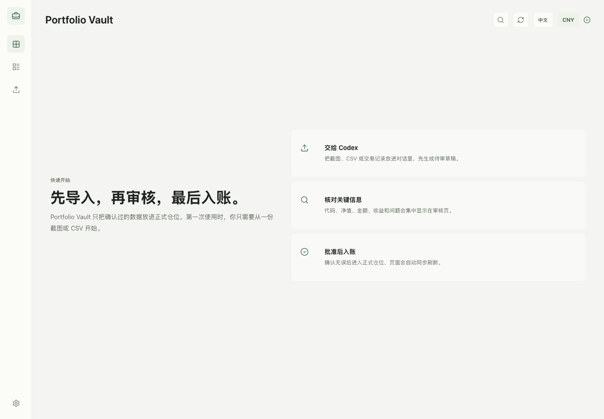

# Portfolio Vault

<p align="center">
  <strong>一个本地优先的 Codex 插件，用于导入、审核和管理个人投资仓位。</strong>
</p>

<p align="center">
  <a href="./README.md">English</a>
</p>

<p align="center">
  <a href="https://github.com/AIDiscovery007/portfolio-vault"></a>
  
  
  
</p>

<p align="center">
  
</p>

Portfolio Vault 可以把 Codex 变成一个轻量的投资仓位工作台。你可以把券商截图或 CSV 放进对话，让 Codex 生成待审导入草稿，在本地 Web UI 里审核，然后确认入账到追加式本地账本。

这个项目的核心原则很简单：个人投资记录应该容易导入、容易审核，并默认保存在本地。

## Codex 安装

打开 Codex，复制下面这段话发送给 Codex：

```text
请帮我安装并启用这个 Codex 插件：https://github.com/AIDiscovery007/portfolio-vault

请你全程代办：把项目下载到合适的本地目录，安装依赖，注册并启用为本地 Codex 插件，初始化 Portfolio Vault 数据目录，然后启动本地 dashboard 并打开页面。

如果需要我确认安装路径、修改 Codex 配置、授权，或重开 Codex 线程，请直接告诉我该点哪里。完成后请告诉我三件事：插件是否启用、vault 数据目录在哪里、dashboard 地址是什么。
```

如果 Codex 提示你刷新插件或开启新对话，照做一次。然后说：

```text
Open Portfolio Vault.
```

后续常用指令：

| 目标 | 可以这样对 Codex 说 |
| --- | --- |
| 打开 dashboard | `打开 Portfolio Vault。` |
| 首次初始化 | `初始化 Portfolio Vault。` |
| 导入仓位 | `把这张券商截图导入 Portfolio Vault，先生成待审草稿。` |
| 查看仓位 | `总结一下我的 Portfolio Vault 仓位。` |
| 干净重置 | `把 Portfolio Vault 重置到首次使用状态。` |

## 亮点

| 模块 | 说明 |
| --- | --- |
| 本地 dashboard | 提供本地页面，用来查看仓位、导入草稿、账户和组合状态。 |
| 先草稿后入账 | 截图和 CSV 会先变成待审草稿，不会直接写入正式账本。 |
| 一键确认入账 | 用户可以在 Web UI 上确认后入账，并带有轻量二次确认。 |
| 标的注册表 | 入账时会基于草稿元数据补全标的注册表，避免出现未映射标的。 |
| 中国基金匹配 | 支持基于固定流程匹配中国基金名称、基金代码和净值数据。 |
| 管理流程 | 内置初始化和重置脚本及 skill，方便首次使用和干净状态测试。 |

## 工作流

```text
券商截图 / CSV
        |
        v
Codex 导入 skill
        |
        v
本地 vault 中的待审草稿
        |
        v
Web UI 审核并确认
        |
        v
追加式账本 + 派生仓位
```

Portfolio Vault 默认把数据存放在：

```text
~/Documents/PortfolioVault
```

插件源码和用户的投资数据目录是分离的。重置 vault 不会删除插件源码。

## 手动安装

```bash
git clone https://github.com/AIDiscovery007/portfolio-vault.git
cd portfolio-vault
npm install
npm run vault:init
npm run dev
```

打开：

```text
http://127.0.0.1:43218/
```

这个仓库已经包含 Codex 本地插件所需的完整结构：

```text
.codex-plugin/plugin.json
.mcp.json
skills/
mcp/
```

把它启用为 Codex 本地插件后，就可以继续用自然语言驱动。

## 自然语言工作流

启用后，可以直接用短句继续操作：

| 目标 | 中文指令 |
| --- | --- |
| 打开 dashboard | `打开 Portfolio Vault。` |
| 首次初始化 | `初始化 Portfolio Vault。` |
| 干净重置 | `把 Portfolio Vault 重置到首次使用状态。` |
| 导入仓位 | `把这张券商截图导入 Portfolio Vault，先生成待审草稿。` |
| 查看仓位 | `总结一下我的 Portfolio Vault 仓位。` |
| 匹配基金 | `帮我匹配这些中国基金名称的准确基金代码和净值。` |

## 脚本

| 命令 | 说明 |
| --- | --- |
| `npm run dev` | 启动本地 Web dashboard。 |
| `npm run build` | 构建生产版本 Web UI。 |
| `npm run check` | 运行 TypeScript 检查。 |
| `npm run vault:init` | 创建缺失的 vault 文件和目录，不删除现有数据。 |
| `npm run vault:reset` | 重置账户、标的、草稿、事件、导入文件和派生仓位；默认创建备份。 |

自定义 vault 目录：

```bash
npm run vault:init -- --vault-dir /path/to/PortfolioVault
npm run vault:reset -- --vault-dir /path/to/PortfolioVault
```

仅在明确需要时跳过备份：

```bash
npm run vault:reset -- --no-backup
```

## 数据模型

Portfolio Vault 使用一个简单的本地文件结构：

```text
PortfolioVault/
  config.json
  events.jsonl
  import-drafts/
  imports/
  derived/
    positions.json
  backups/
```

关键原则：

- 正式记录采用追加式账本事件。
- 导入内容先进入草稿，审核后才入账。
- 派生仓位可以从账本状态重新生成。
- 草稿行有足够元数据时，入账流程会自动注册标的元数据。
- 基准币种会从账户或导入数据中推断，并在 UI 中显示。

## 内置 Skills

| Skill | 说明 |
| --- | --- |
| `portfolio-vault-open` | 打开本地服务和 dashboard。 |
| `portfolio-vault-admin` | 初始化或重置 vault 数据目录。 |
| `portfolio-vault-import` | 把截图或 CSV 转成可审核导入草稿。 |
| `portfolio-vault-fund-lookup` | 匹配中国基金名称、官方代码和净值数据。 |
| `portfolio-vault-query` | 读取并总结账户、草稿、标的、仓位和收益。 |

## 安全说明

Portfolio Vault 是记录和审核工具，不会执行交易，也不提供买卖指令。

除非你主动共享或上传文件，金融数据会保存在本地 vault 目录中。不要把 `~/Documents/PortfolioVault` 提交到这个仓库。

## 开发

```bash
npm run check
npm run build
```

UI 基于 React、Vite 和 Lucide icons 构建。本地服务的 API 路由在 `vite.config.ts` 中，MCP server 位于 `mcp/`。

## 许可证

MIT 许可证。详见 [LICENSE](./LICENSE)。
